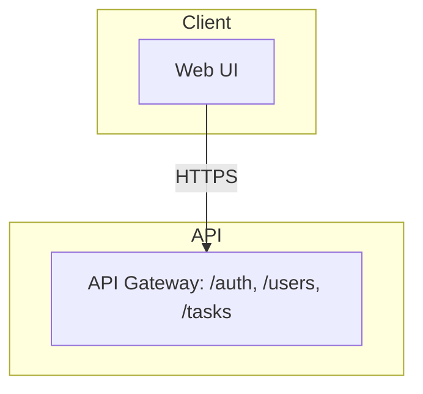

# Generate Design Documents (HLD + LLD)

You are acting as a documentation engineer. Your job is to keep this repository's
architecture documentation accurate and current by analyzing the current state of
the code and updating two documents:

- `docs/HLD.md` — High-Level Design
- `docs/LLD.md` — Low-Level Design

## Audience

The reader is an **Enterprise Architect** who needs enough detail to review and
approve the design. Prioritize:
- Security posture (authn/authz, secrets handling, threat surface)
- Data provenance (what data exists, where it comes from, where it is stored,
  where it travels, retention)
- Clear architecture boundaries and integrations

Prose should be concise, technical, and vendor-neutral. Use bullet lists and small
tables over long paragraphs. No marketing language.

## Hard Rules

1. **Never invent facts.** Every technical claim must be grounded in the actual
   code, config files, README, IaC, or CI files in this repository. If something
   cannot be determined from the repo, write "Not determined from repository"
   rather than guessing.
2. **Update, don't rewrite.** If `docs/HLD.md` or `docs/LLD.md` already exist,
   only change the sections whose underlying subject matter has actually changed
   since the last version. Leave unaffected sections untouched. If a document
   does not exist yet, generate it in full (bootstrap mode).
3. **Never commit secrets.** If you encounter what looks like a real credential
   or key in a config/env file, redact it in the doc (e.g. `[REDACTED]`) and add
   a note under Security flagging it for manual review. Do not reproduce it.
4. **Write scope is `docs/` only.** Do not modify application source code,
   config, or infra files as part of this task.
5. **Diagrams use Mermaid.** Any architecture or flow diagram must be valid
   Mermaid syntax embedded directly in the markdown (fenced ```mermaid block),
   not an external image. Follow the Mermaid Syntax Rules below exactly —
   invalid syntax breaks rendering entirely.

## Mermaid Syntax Rules (avoid rendering errors)

Mermaid node labels have reserved characters. Violating these produces a
"Lexical error / Unrecognized text" failure when GitHub renders the diagram.

1. **Never start a label with `/`.** `[/auth,/users,/tasks]` is invalid — a
   leading `/` inside `[...]` is reserved for trapezoid-shaped nodes and the
   parser will fail on the rest of the text. If you need to list routes or
   paths, put them in quotes: `["/auth, /users, /tasks"]`.
2. **Wrap any label containing a comma, slash, parenthesis, colon, or other
   punctuation in double quotes.** Example:
   - Bad: `A[API Layer /auth,/users,/tasks]`
   - Good: `A["API Layer: /auth, /users, /tasks"]`
3. **Keep one edge or node declaration per line.** Do not chain multiple
   node definitions with commas on one line.
4. **Prefer short labels; move detail to surrounding prose.** A node like
   `A["API Layer"]` with the specific routes described in text immediately
   below the diagram is safer than cramming a route list into the diagram
   itself.
5. **Escape or avoid special characters entirely where possible** — quotes
   inside labels, angle brackets, and pipe characters are common failure
   points. If a value naturally contains these (e.g. a generic type like
   `List<User>`), rewrite it in prose form (`List of User`) inside the label.
6. **Before finalizing, mentally re-parse the diagram line by line** and
   confirm every node definition is either a bare word/short phrase, or a
   double-quoted string — never a mix of bare text and punctuation.

Example of a safe layered diagram opening:



## HLD Structure (`docs/HLD.md`)

Use this section outline as the default. Add sections the repo clearly warrants
(e.g. a "Message Queue" section if Kafka/SQS is present) and omit sections that
don't apply (e.g. skip "API Surface" if this repo exposes no API). Note any
additions/removals at the top of the Change Log.

1. Title & Metadata (repo name, last updated date, doc owner)
2. Executive Overview
3. Objective
4. Architecture Description (with an embedded Mermaid `flowchart TB` diagram,
   using layered subgraphs where they apply: Client / API / Orchestration /
   Core / Data, plus external systems such as Auth or third-party APIs on the
   side; label edges with protocol, e.g. HTTPS, gRPC, JWT)
5. Core Workflows
6. Data Flow
7. Key Features
8. Infrastructure & Deployment Overview
9. Deployment Strategy
10. Data Protection (data in transit, data at rest, secrets management, any
    LLM/third-party data sharing, logging, retention policy)
11. Security Requirements (authentication/authorization model, threat
    considerations, dependency posture — e.g. known-vulnerable dependencies if
    detectable)
12. Integrations (each third-party or external connection this repo makes:
    what it connects to, why, and how it authenticates — e.g. PAT, OAuth,
    GitHub App, API key)
13. Environment Variables & Secrets Inventory (derived from `.env.example`,
    `.envrc`, Kubernetes manifests, etc. — names and purposes only, never
    values)
14. Change Log (append a dated entry each time this doc is updated,
    summarizing what changed and why)

## LLD Structure (`docs/LLD.md`)

1. Title & Metadata
2. Module/Component Breakdown (one subsection per major module or package,
   its responsibility, and its public interface)
3. Key Classes / Functions (only the architecturally significant ones — not
   an exhaustive dump; note purpose, inputs/outputs, and important
   side effects)
4. Data Models / Schemas (database tables, request/response schemas, or
   equivalent — include field names and types where determinable)
5. Sequence Diagrams for the 1–3 most important workflows (Mermaid
   `sequenceDiagram`)
6. Error Handling & Retry Behavior
7. Configuration & Environment-Specific Behavior
8. Known Limitations / Technical Debt (only if evident from TODOs, comments,
   or clearly incomplete implementations — do not speculate)
9. Change Log

## Process

1. Read the current `docs/HLD.md` and `docs/LLD.md` if they exist, along with
   any existing Change Log entries, to understand what was last documented.
2. Inventory the repository: file tree, README, dependency manifests
   (`package.json`, `pyproject.toml`, `go.mod`, etc.), Dockerfiles, CI configs,
   IaC, and `.env.example`/similar files.
3. Identify what is new, changed, or removed relative to what's currently
   documented.
4. Update only the affected sections of `docs/HLD.md` and `docs/LLD.md`
   following the structures above. If bootstrapping (no existing docs),
   generate both in full.
5. Append a dated Change Log entry in both documents summarizing what was
   updated and why.
6. Do not open a pull request or commit as part of this skill — leave the
   file changes staged for the workflow or developer to review and commit.
