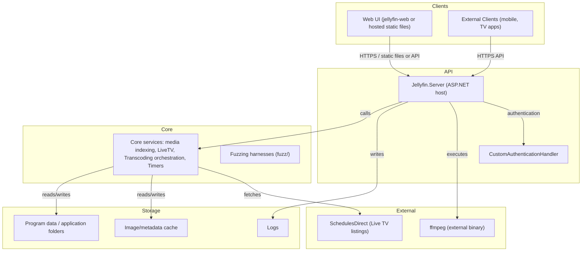

# High-Level Design (HLD)

**Repository:** NikithaJoshy/jellyfin
**Last updated:** 2026-09-10 (generated from repository analysis)
**Doc owner:** Not determined from repository

## Executive overview

Jellyfin is a .NET 10 backend server for self-hosted media management and streaming. It provides HTTP APIs used by the web client and other clients, coordinates media processing (ffmpeg), and manages users, sessions, and media metadata. This document summarizes architecture, security posture, data provenance, and deployment-relevant details found in the repository.

### Stack
- Language(s): C# (primary)
- Framework / runtime: .NET 10 (repository README references .NET 10 SDK)
- Notable libraries / components (observed in code):
  - Serilog (logging initialization referenced in Program.cs)
  - Command-line parser (Parser.Default.ParseArguments in Program.cs)
  - SharpFuzz (fuzzing support under fuzz/)
  - JSON System.Text.Json DTOs (JsonPropertyName attributes)

## Architecture description

A simplified runtime view (clients, API, core services, data/storage, external systems).

Notes:
- The server can host the web client static files; the README documents a `--webdir` option and a `JELLYFIN_NOWEBCONTENT` env var for running without hosting the web client.
- The repository contains a number of projects (solution file Jellyfin.sln and several top-level projects and folders) indicating a modular server: core server, API, providers, implementations, and Live TV adapters.

## Core workflows (short)
- Startup: Program.Main parses CLI args, initializes logging and configuration, and starts the ASP.NET host (Program.cs).
- Authentication: CustomAuthenticationHandler wraps the repository's auth service, producing ClaimsPrincipal with device/client/version claims and supporting API keys and user tokens (Jellyfin.Api/Auth/CustomAuthenticationHandler.cs).
- Media handling: Services index media, manage metadata, and coordinate transcoding via ffmpeg (ffmpeg referenced in README as required external binary).
- Live TV: Adapter code (Jellyfin.LiveTv and SchedulesDirect integration) fetches program listings and produces ProgramInfo objects.

## Data flow / provenance
- User/account data: represented by User/UserDto types and stored/managed by authentication providers. Passwords are stored as password hashes; cryptography providers handle hashing and verification (DefaultAuthenticationProvider migrates old hashes to a default method).
- Session & tokens: AuthenticationInfo and AuthenticationResult classes contain AccessToken, DeviceId, AppName, UserId, and DateCreated/DateLastActivity — the server issues and records tokens for sessions.
- Media metadata: DTOs (e.g., ProgramDetailsDto, TitleDto) are populated from external APIs (SchedulesDirect) or local metadata providers (MediaBrowser.LocalMetadata).
- File paths / storage: SystemStorageInfo and SystemInfo classes define folders for ProgramData, Web, Cache, Logs, InternalMetadata, and TranscodingTemp — these are the canonical locations for persisted artifacts.

For any specific storage backend (database type, remote blob store), the repository does not provide an explicit global declaration — Not determined from repository.

## Key features observed
- Multiple authentication providers (IAuthenticationProvider) with a DefaultAuthenticationProvider that verifies hashes and can change/migrate passwords.
- Custom authentication handler that emits claims including device, token, and API key boolean.
- Live TV support and listing providers (SchedulesDirect integration present in src/Jellyfin.LiveTv/Listings).
- Fuzzing harnesses for security testing (fuzz/ with SharpFuzz and AFL++ instructions in fuzz/README.md).
- Modular project layout with many projects and a central solution file (Jellyfin.sln).

## Infrastructure & deployment overview
- The README documents local development with dotnet run, Visual Studio, and Codespaces hints.
- External binary ffmpeg is required (README notes jellyfin-ffmpeg repo).
- Deployment examples: deployment/unraid/docker-templates present (unraid docker template).
- No single CI/CD pipeline or hosting provider is determinable from repository files read so far; README references Azure for unit test validation but workflow config files were not inspected in detail — where specifics cannot be confirmed say "Not determined from repository".

## Data protection
- Data in transit: API is accessed over HTTP(S) — the README and code refer to API endpoints and Swagger, but TLS termination and cert management are environment-specific (Not determined from repository).
- Data at rest: sensitive values include stored password hashes, access tokens (AuthenticationInfo.AccessToken), and possibly API keys — repository shows password hashing and migration (cryptography provider) but not a centralized secrets store.
- Secrets handling: code references environment variables (e.g., JELLYFIN_LOG_DIR and JELLYFIN_NOWEBCONTENT). No `.env.example` or secrets-management config was found in the inspected files; assume secrets (TLS certs, database credentials, external API keys) are provided by the hosting environment — Not determined from repository.
- Logging: Serilog is initialized; logging configuration files named `logging.default.json` and `logging.json` are referenced; these likely control log sinks and levels. Ensure logs do not inadvertently include secrets.
- Retention: No explicit retention policy located in the repository (Not determined from repository).

## Security summary / requirements
- Authentication: Claims-based authentication with support for API keys and tokens. The CustomAuthenticationHandler maps token/API-key results to Administrator role when appropriate.
- Password storage: Uses PasswordHash with a cryptography provider. DefaultAuthenticationProvider enforces verification via ICryptoProvider and migrates outdated hashes to the current default.
- Threat surface highlights (derived from code):
  - HTTP endpoints that accept tokens and credentials (ensure TLS in production to protect tokens and passwords in transit).
  - Execution of external processes (ffmpeg) — validate inputs and run under least privilege to avoid command injection / privilege escalation.
  - External integrations (SchedulesDirect) and any 3rd-party APIs — credentials management and rate-limiting are relevant.

## Integrations
- Web client (jellyfin-web): server can host static files or rely on externally hosted web client; README includes details and a recommended separate hosting approach.
- ffmpeg: required external binary for media processing.
- SchedulesDirect: integration for Live TV listings (src/Jellyfin.LiveTv/Listings/SchedulesDirect).

## Environment variables & secrets inventory (observed)
- JELLYFIN_LOG_DIR — used in Program.cs to set logging directory in startup.
- JELLYFIN_NOWEBCONTENT — mentioned in README to disable hosting web client.

Other sensitive configuration keys, API keys, or database credentials: Not determined from repository.

## Change log
- Generated sections: Architecture, Security, Data Flow, Integrations. Sections omitted or marked "Not determined from repository" where the repo does not contain authoritative information (database backend, deployment CI specifics, secrets vaults, retention policy).

---

(End of HLD)
