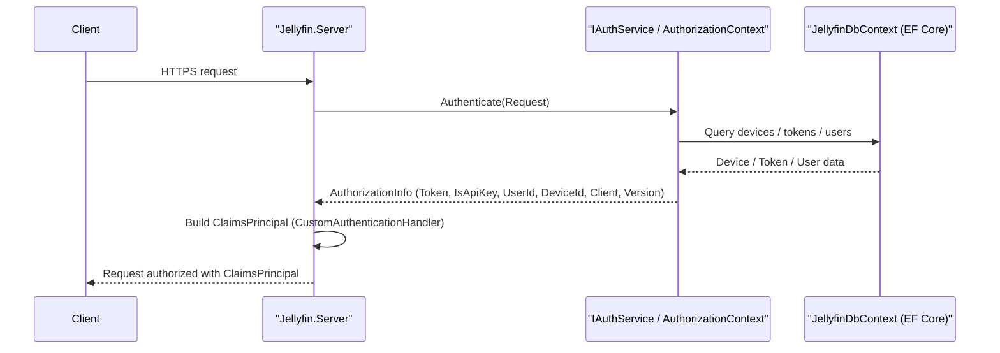

# Low-Level Design (LLD)

**Repository:** NikithaJoshy/jellyfin
**Last updated:** 2026-09-11 (generated from repository analysis)
**Doc owner:** Not determined from repository

## Objective

Provide an implementation-oriented, evidence-backed description of how the Jellyfin server starts and runs, how authentication/authorization, persistence, logging, and integrations are wired, and highlight security and data-provenance controls and open items that are not determinable from the repository.

---

## 1. Runtime components and binary layout

Key projects / files (representative, evidence-backed):
- Jellyfin.Server — entrypoint and application lifecycle (Jellyfin.Server/Program.cs).
- Jellyfin.Api — API surface and auth handler (Jellyfin.Api/Auth/CustomAuthenticationHandler.cs).
- src/Jellyfin.Database/Jellyfin.Database.Implementations/JellyfinDbContext.cs — EF Core DbContext and DbSet<TEntity> definitions.
- src/Jellyfin.Database/Jellyfin.Database.Providers.Sqlite/SqliteDatabaseProvider.cs — SQLite provider maintenance (VACUUM/PRAGMA), backup/restore routines.
- src/Jellyfin.LiveTv/Listings/SchedulesDirect.cs — external listings integration (HttpClient usage, cache files, daily limits).
- fuzz/ — SharpFuzz fuzzing harnesses and instructions (fuzz/README.md).
- MediaBrowser.Model/System/SystemStorageInfo.cs, MediaBrowser.Model/System/SystemInfo.cs — canonical storage folders DTOs.

---

## 2. Startup & host initialization (detailed)

Evidence and observed sequence (from Jellyfin.Server/Program.cs):
1. CLI parsing via Parser.Default.ParseArguments<StartupOptions>(args).
2. Create application paths with StartupHelpers.CreateApplicationPaths(options); run sanity check.
3. Set environment variables: JELLYFIN_LOG_DIR, NEOReadDebugKeys, EnableExtendedVaFormats.
4. Initialize logging configuration with StartupHelpers.InitLoggingConfigFile(appPaths).
5. Create IConfiguration via CreateAppConfiguration(options, appPaths).
6. Initialize logging framework (StartupHelpers.InitializeLoggingFramework).
7. Instantiate SetupServer and call RunAsync(); SetupServer prepares the application host and services.
8. Serilog is used (SerilogLoggerFactory referenced in Program.cs).

Not determined from repository:
- Exact host-builder call site (no direct public CreateHostBuilder/ConfigureWebHostDefaults symbol found in the scanned files).
- Full middleware pipeline (the file(s) that call AddControllers, AddAuthentication, UseRouting, etc. were not located by lexical search in the inspected subset).

---

## 3. Dependency injection & service registration (what we know)

Evidence of DI patterns:
- Constructor injection is widespread: examples include SchedulesDirect(ILogger<SchedulesDirect>, IHttpClientFactory, IApplicationPaths) and many other services using ILogger<T>, IHttpClientFactory, IDbContextFactory<JellyfinDbContext>.
- IDbContextFactory<JellyfinDbContext> is used across health checks, scheduled tasks, and services to obtain DbContext instances on demand.

Concrete DI usages (code-level):
- IHttpClientFactory used in SchedulesDirect for external HTTP calls.
- IDbContextFactory<JellyfinDbContext> used for creating EF Core contexts.
- ILogger<T> used pervasively for structured logging.

Not determined:
- The single file/place where all services are registered (AddDbContext/AddHttpClient/AddAuthentication) — not found by the searches performed.

---

## 4. Authentication & Authorization — low-level flow

Files inspected:
- Jellyfin.Api/Auth/CustomAuthenticationHandler.cs
- Jellyfin.Server.Implementations/Security/AuthorizationContext.cs
- MediaBrowser.Controller/Authentication/IAuthenticationProvider.cs
- Jellyfin.Server.Implementations/Users/DefaultAuthenticationProvider.cs
- MediaBrowser.Controller/Security/AuthenticationInfo.cs
- MediaBrowser.Controller/Authentication/AuthenticationResult.cs

Authentication flow (evidence-backed sequence):
1. Incoming HTTP request reaches authentication middleware; CustomAuthenticationHandler.HandleAuthenticateAsync() is invoked.
2. CustomAuthenticationHandler calls IAuthService.Authenticate(Request) to obtain authorization information.
3. If authorizationInfo.HasToken is false, the handler returns AuthenticateResult.NoResult() (anonymous request).
4. If token exists, handler maps role to Administrator when authorizationInfo.IsApiKey is true or the user has the IsAdministrator permission.
5. Handler creates claims (Name, Role, InternalClaimTypes.UserId, DeviceId, Device, Client, Version, Token, IsApiKey), builds a ClaimsPrincipal and returns AuthenticateResult.Success(ticket).
6. AuthorizationContext extracts token/device/client/version from request headers, query parameters, or legacy headers and uses IDbContextFactory<JellyfinDbContext> to resolve devices/tokens/users in DB.

Security-related notes (evidence):
- Legacy authorization headers (X-Emby-Token and X-MediaBrowser-Token) are supported when EnableLegacyAuthorization configuration is enabled.
- The DefaultAuthenticationProvider verifies password hashes via ICryptoProvider and migrates old hash formats to the current default when parameters differ.
- AuthenticationInfo and AuthenticationResult types show structure of tokens (AccessToken, DeviceId, UserId, DateCreated, DateLastActivity) stored/used by the system.

Safe sequence diagram (Mermaid):


---

## 5. Persistence & schema

Concrete evidence:
- JellyfinDbContext defines DbSet<TEntity> for Users, ApiKeys, Devices, ImageInfos, ActivityLogs, Permissions, Preferences, UserData, BaseItems, etc. (src/Jellyfin.Database/Jellyfin.Database.Implementations/JellyfinDbContext.cs).
- A Sqlite provider is present (src/Jellyfin.Database/Jellyfin.Database.Providers.Sqlite/SqliteDatabaseProvider.cs) with maintenance logic (PRAGMA checkpoint, VACUUM, ANALYZE) and backup/restore via file copy.
- Migration routines and a JellyfinMigrationService exist to create DB, apply migrations, and seed startup scripts (Jellyfin.Server/Migrations/).

Operational behaviors:
- Backups: MigrationBackupFast in the SQLite provider copies jellyfin.db to a timestamped backup location under the application data path.
- Health checks: DbContextFactoryHealthCheck<TContext> runs dbContext.Database.CanConnectAsync() to check DB availability.
- Scheduled maintenance: SQL optimizations and VACUUM are performed during shutdown/maintenance routines.

Data storage locations and provenance:
- SystemStorageInfo/SystemInfo classes indicate canonical folders: ProgramDataFolder, WebFolder, ImageCacheFolder, CacheFolder, LogFolder, InternalMetadataFolder, TranscodingTempFolder, Libraries.
- User and session artifacts are persisted in relational DB tables (Users, ApiKeys, Devices, ActivityLogs, AuthenticationInfo).
- External listings (SchedulesDirect) and image metadata are cached as files under cache path (SchedulesDirect references files like sd-countries.json and sd-image-limit.txt).

Not determined:
- Definitive production database providers beyond SQLite (the SQLite provider exists, but other provider registrations were not located in inspected files).
- The exact location of DB connection strings (no explicit appsettings.json or environment mapping file was found in the inspected subset).

---

## 6. Logging & observability

Evidence:
- Program.cs references Serilog and logging configuration files `logging.default.json` and `logging.json` and calls StartupHelpers.InitializeLoggingFramework(startupConfig, appPaths).
- Code uses ILogger<T> widely; ActivityLog entity and migration routines persist activity entries to DB.

Observability features:
- Structured logging via Serilog (SerilogLoggerFactory).
- Health checks for DB connectivity.
- Activity logging persisted into an ActivityLog DB table.

Not determined:
- Serilog sinks, retention, and rotation policies because the referenced logging JSON files were not located in the inspected files.

---

## 7. External integrations and network calls

SchedulesDirect (src/Jellyfin.LiveTv/Listings/SchedulesDirect.cs):
- Calls https://json.schedulesdirect.org endpoints for tokens, schedules, programs, and images using an IHttpClientFactory-created client.
- Persists tokens in-memory with time TTL and caches country/image metadata on disk (cachePath).
- Uses SHA1(password) for SD token request (SD requires hashed password in that flow).
- Implements backoff logic and daily limit persistence files (sd-image-limit.txt, sd-metadata-limit.txt).

ffmpeg:
- README documents a requirement for external ffmpeg (jellyfin-ffmpeg). Server executes ffmpeg for media processing/transcoding (not bundled in repo) — ensure execution context and input validation.

Web client:
- Server can host static files for the web client (README describes `--webdir` option) or can be run with JELLYFIN_NOWEBCONTENT to disable hosting.

---

## 8. Secrets, environment variables, config

Observed environment variables and config entries:
- JELLYFIN_LOG_DIR — explicitly set in Program.cs to the application log directory path.
- JELLYFIN_NOWEBCONTENT — documented in README as a toggle to not host web client.
- EnableLegacyAuthorization — configuration toggle used in AuthorizationContext to gate legacy headers.

Secrets handling (observed):
- Tokens and API keys are stored in DB tables (ApiKeys, Device tokens). No external secrets vault integration code was located.
- No `.env.example` or centralized secret-management template was found in the inspected files (Not determined from repository).

Recommendation (evidence-aligned):
- Treat DB backups and cached token files as sensitive; apply file system permissions to restrict access to the jellyfin service account.

---

## 9. Maintenance & operational tasks (found in code)

- Database optimization (PRAGMA wal_checkpoint, VACUUM, ANALYZE) performed by the SQLite provider during shutdown or maintenance.
- Migrations: JellyfinMigrationService ensures relational DB is created, runs migrations, and inserts startup migration entries.
- Scheduled tasks: Example CleanupUserDataTask deletes detached user data older than a configured retention window (the example uses 90 days in code).
- Backups: Sqlite provider implements MigrationBackupFast by copying jellyfin.db to a backup folder.

---

## 10. Security & threat-surface notes (evidence-based)

Authentication/authorization:
- Tokens and API keys are accepted from headers and query parameters; AuthorizationContext explicitly looks in headers and query params. Query-parameter tokens can be exposed via URLs and logs — take care in proxies and logging.
- DefaultAuthenticationProvider performs password hash verification and migrates old hashes to current default; ICryptoProvider handles hashing algorithm choices.

External processes & external calls:
- ffmpeg is executed externally (risk of input-related exploitation if not isolated).
- SchedulesDirect integration calls external HTTP endpoints and persists tokens — code includes robust handling of SD-specific error codes and backoff behavior.

Logging & secrets:
- Logging configuration files were referenced but not inspected; verify logging does not include tokens or passwords.

Retention & deletion:
- Cleanup tasks provide a pattern for retention, but retention policies for logs/media/cache are not defined in inspected files (Not determined).

---

## 11. File-level mapping (quick reference)
- Startup & logging: Jellyfin.Server/Program.cs
- Custom authentication handler: Jellyfin.Api/Auth/CustomAuthenticationHandler.cs
- Authorization and token parsing: Jellyfin.Server.Implementations/Security/AuthorizationContext.cs
- Database schema: src/Jellyfin.Database/Jellyfin.Database.Implementations/JellyfinDbContext.cs
- SQLite provider: src/Jellyfin.Database/Jellyfin.Database.Providers.Sqlite/SqliteDatabaseProvider.cs
- Migrations: Jellyfin.Server/Migrations/* (e.g., JellyfinMigrationService.cs)
- Live TV integration: src/Jellyfin.LiveTv/Listings/SchedulesDirect.cs
- Fuzzing: fuzz/ and related harness files
- Storage DTOs: MediaBrowser.Model/System/SystemStorageInfo.cs, MediaBrowser.Model/System/SystemInfo.cs

---

## 12. Known unknowns (explicitly marked "Not determined from repository")
- The global service registration and the explicit middleware pipeline (exact ConfigureServices/Configure where AddAuthentication/AddControllers/AddDbContext/AddHttpClient are called).
- Contents of logging.default.json and logging.json (sinks and filters).
- Exact production DB providers used beyond the SQLite provider present in the repository snapshot.
- appsettings.json or environment-specific configuration templates that reveal connection strings and secrets provisioning.
- CI/CD manifests and deployment-specific secrets handling (no explicit workflow or secrets templates inspected).

---

## 13. Reviewer checklist (concrete follow-ups)
- Locate the host builder/service registration to verify middleware order (Ensure UseHttpsRedirection, UseHsts, UseAuthentication, UseAuthorization are configured properly).
- Inspect logging.default.json / logging.json and add filters to redact tokens/API keys and avoid logging query strings that may contain secrets.
- Confirm database configuration in deployment manifests: if SQLite is used in production, document concurrency/backups/restore policies; if RDBMS (Postgres/SQL Server) are used, document connection string sourcing and credential rotation.
- Audit ffmpeg execution context (user privileges, chroot/containerization) to reduce privilege escalation and injection risks.
- Document retention policies for logs, caches, and detached user data; align CleanupUserDataTask with organizational policy.

---

## Appendix: Component diagram (Mermaid)
```mermaid
flowchart TB
  Client["Clients: Web UI / Mobile / TV Apps"]
  Server["Jellyfin.Server (ASP.NET)"]
  Auth["IAuthService / AuthorizationContext"]
  Claims["CustomAuthenticationHandler -> ClaimsPrincipal"]
  DB["Relational DB (JellyfinDbContext)"]
  Cache["File cache / image files (CachePath)"]
  FFmpeg["External binary: ffmpeg"]
  SD["SchedulesDirect (external API)"]

  Client -->|HTTPS| Server
  Server --> Auth
  Auth -->|DB queries (Devices/ApiKeys/Users)| DB
  Server --> Claims
  Server -->|reads/writes media metadata| DB
  Server -->|reads/writes cached images/files| Cache
  Server -->|executes| FFmpeg
  Server -->|HTTP token calls| SD
```

---

All points in this LLD are grounded in the repository files reviewed; where the repository did not contain authoritative material I have explicitly marked the item "Not determined from repository".
